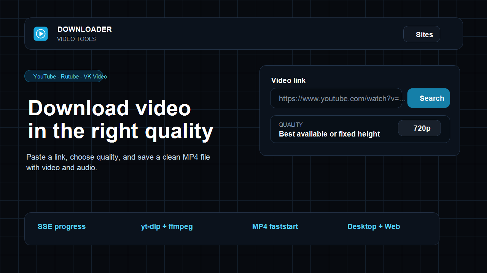
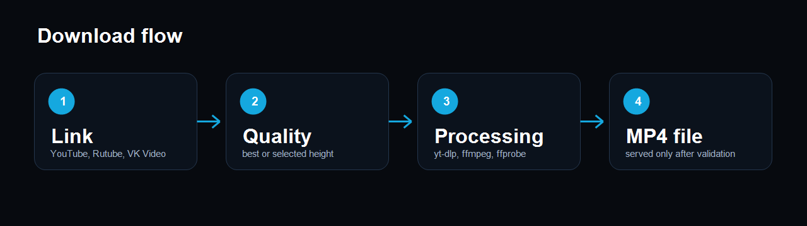

# YouTube Downloader

Desktop and web video downloader for YouTube, Rutube, and VK Video.

The project uses a React/Vite frontend, an Elysia API server on Bun, and an Electron desktop wrapper. Downloads are handled by `yt-dlp`; final MP4 validation and compatibility processing are handled by `ffmpeg` and `ffprobe`.



## Что это

Локальное приложение для скачивания видео в MP4. Работает как сайт в браузере и как desktop-окно через Electron.

Поддерживаются:

- YouTube
- Rutube
- VK Video / `vkvideo.ru`

Главная цель проекта: вставить ссылку, выбрать качество, получить нормальный MP4 с видео и звуком.

## Что умеет

- выбор качества от `144p` до `2160p` или `best`;
- скачивание видео и аудио с последующим объединением;
- корректная обработка Rutube HLS через `ffmpeg`;
- поддержка YouTube-ссылок с `list`, `index`, `start_radio`;
- поддержка VK Video ссылок вида `https://vkvideo.ru/video-228275494_456239115`;
- SSE-прогресс загрузки без WebSocket;
- отмена активной загрузки;
- проверка готового файла через `ffprobe`;
- toast-уведомления об ошибках и статусах;
- запуск по ярлыку на Windows.



## Требования

Нужно установить отдельно:

- Bun 1.x+
- `yt-dlp`
- `ffmpeg`
- `ffprobe`

Проверка:

```bash
yt-dlp --version
ffmpeg -version
ffprobe -version
```

## Установка

```bash
bun install
```

Создайте `.env` в корне проекта:

```env
VITE_FRONTEND_URL=http://localhost:5173
VITE_API_URL=http://localhost:3001

YTDLP_PROXY=
YTDLP_FORCE_IPV4=true
```

## Запуск сайта

```bash
bun run dev
```

Открыть:

```text
http://localhost:5173
```

Отдельно:

```bash
bun run dev:web
bun run dev:server
```

## Desktop-запуск

Из терминала:

```bash
bun run desktop
```

На Windows двойным кликом:

```text
desktop/YouTube Downloader.cmd
```

Создать ярлык на рабочем столе:

```powershell
powershell -ExecutionPolicy Bypass -File desktop/create-desktop-shortcut.ps1
```

Desktop-режим использует тот же frontend и backend. `yt-dlp`, `ffmpeg`, `ffprobe` должны быть доступны в `PATH`.

## YouTube через Zapret

Если YouTube недоступен напрямую, приложение может работать через системный Zapret.

Для системного Zapret:

```env
YTDLP_PROXY=
YTDLP_FORCE_IPV4=true
```

Проверка доступа:

```powershell
curl.exe -4 -I --max-time 20 https://www.youtube.com
```

Если нужен отдельный proxy:

```env
YTDLP_PROXY=socks5://127.0.0.1:1080
```

Локальные proxy-значения не коммитить.

## API

| Endpoint | Method | Назначение |
| --- | --- | --- |
| `/api/health` | GET | проверка backend |
| `/api/video/info?url=...` | GET | информация о видео |
| `/api/video/download?url=...&quality=720` | GET | старт загрузки |
| `/api/video/progress/:id` | GET | SSE-прогресс |
| `/api/video/cancel/:id` | POST | отмена загрузки |
| `/api/video/file/:id` | GET | получение готового файла |

## Команды

| Команда | Назначение |
| --- | --- |
| `bun run dev` | frontend + backend |
| `bun run desktop` | Electron-приложение |
| `bun run build:web` | сборка frontend |
| `bun --filter web lint` | lint frontend |
| `bunx tsc -p apps/server/tsconfig.json` | typecheck backend |

## Структура

```text
YouTube_Downloader/
+-- apps/
|   +-- server/
|   +-- web/
|   +-- downloads_files/
+-- desktop/
|   +-- app-icon.ico
|   +-- app-icon.png
|   +-- main.cjs
|   +-- YouTube Downloader.cmd
+-- docs/
|   +-- images/
+-- README.md
+-- package.json
+-- tsconfig.json
```

## Как работает загрузка

1. Frontend отправляет ссылку на backend.
2. Backend получает метаданные через `yt-dlp`.
3. Пользователь выбирает качество.
4. Backend скачивает потоки и собирает MP4 через `ffmpeg`.
5. `ffprobe` проверяет итоговый файл.
6. Клиент получает файл только после статуса `finished`.

SQLite не используется. История загрузок не хранится, файл сразу отдаётся пользователю.

## Перед публикацией

```bash
bun run build:web
bun --filter web lint
bunx tsc -p apps/server/tsconfig.json
```

Не коммитить:

- `.env`
- скачанные видео;
- временные файлы;
- логи;
- build/cache артефакты.
