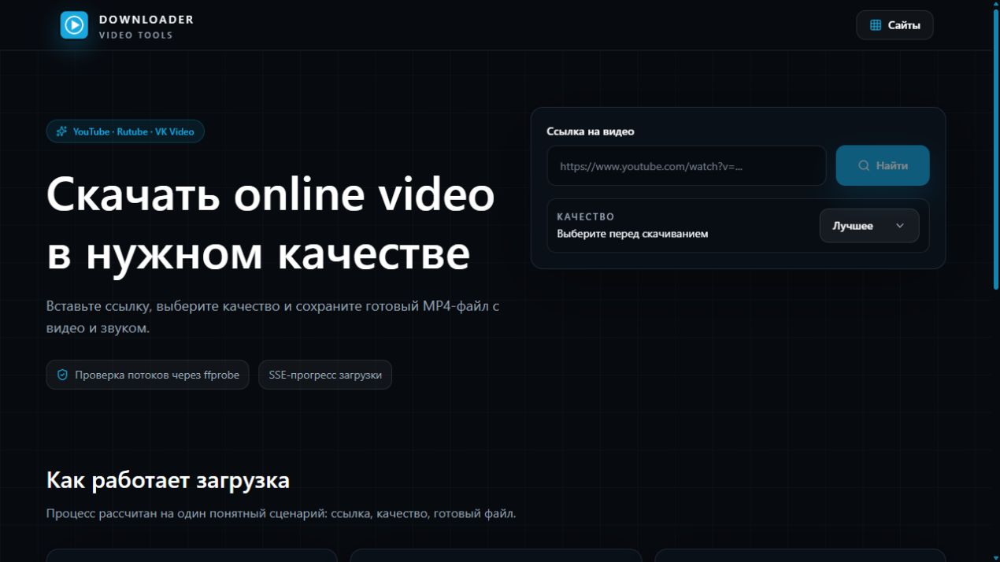
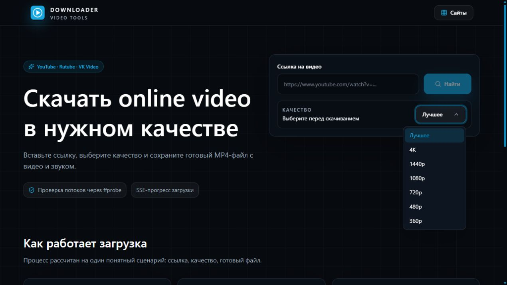
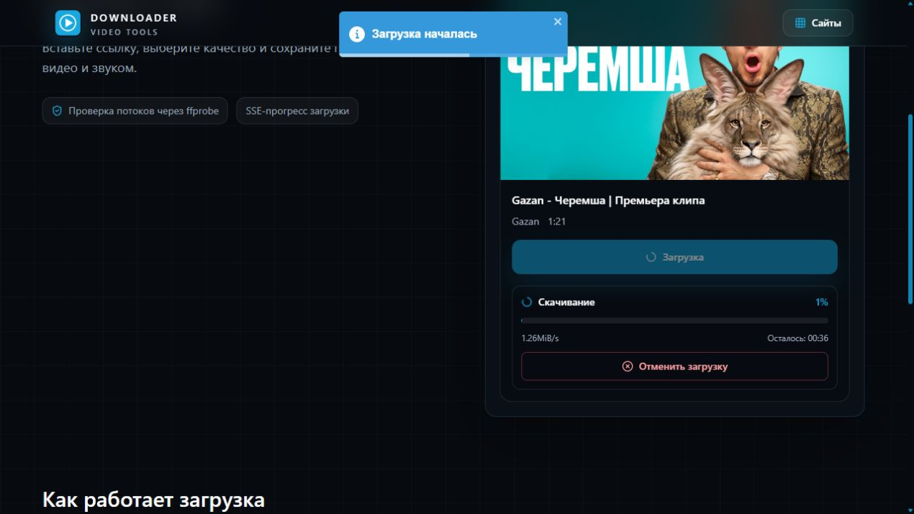

# YouTube Downloader

Desktop and web video downloader for YouTube, Rutube, and VK Video.

The project uses a React/Vite frontend, an Elysia API server on Bun, and an Electron desktop wrapper. Downloads are handled by `yt-dlp`; final MP4 validation and compatibility processing are handled by `ffmpeg` and `ffprobe`.

## Скачать видео без лишнего

Вставьте ссылку, выберите качество и получите готовый MP4 с видео и звуком.



## Выберите качество

Доступны лучшее качество и разрешения до 4K - приложение использует лучшее доступное видео и аудио для выбранного варианта.



## Видно, что происходит

Во время загрузки показываются прогресс, скорость и оставшееся время. Загрузку можно отменить.



## Поддерживаемые сайты

- YouTube
- Rutube
- VK Video / `vkvideo.ru`

## Что нужно

- Bun 1.x+
- `yt-dlp`
- `ffmpeg` и `ffprobe`

## Запуск

```bash
bun install
bun run dev
```

Откройте `http://localhost:5173`.

На Windows desktop-версия запускается двойным кликом по `desktop/YouTube Downloader.cmd`.
